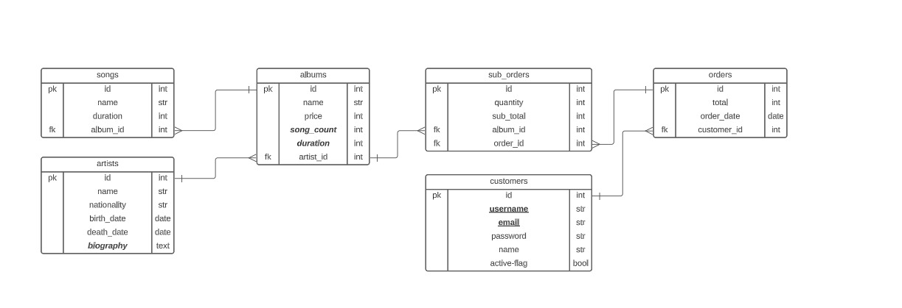

# README

## Considerations

The scenario presented assumes that the project receives existing data from the sale of a record label.
For this, it is assumed or initialized, with the following considerations:

1. Artists and users are created first, assuming that their data is correct.
1. As a result of these, the albums are created, with the established date, and then each song to which it belongs is included one by one. (It is assumed that the entry is uniform, since at the end, the duration table of said album is added # It is done in the following way to avoid resorting to the callback).
1. The record of the purchase or order, for this the object is created, and then the data of each item of the order begins to be loaded
1. Finally, the user data and date where the purchase is made are loaded. (It must be verified that this date is greater than the date of the artist's birth, the date of the creation of albums, and to make sure that it is not from the future, it must be less than the date of today).

For better understanding, the following logic is proposed:

```
create artist
create user
create album
  duration=0 # album duration
  while value=true
    create song, album_id
    duration+=song.duration
    value = false if end
  add duration
create order
  total=0
  while value_1=true
    create order_item, album_id, user_id
      sub_total=0
      while value_2=true
        add album.id
        add album.price as price
        add quantity
        sub_total+=price*quantity
        value_2 = false if end
      add sub_total
    value_1 = false if end
  add total
  add user
  add dates
```

## Model Creation

1.  ERD (Entity relationship diagram).

    

    The corresponding relationships between the models are shown below:

    | Model       | Relation   | Model       |
    | :---------- | :--------- | :---------- |
    | artists     | has_many   | albums      |
    | albums      | belongs_to | artists     |
    | albums      | has_many   | songs       |
    | songs       | belongs_to | albums      |
    | albums      | has_many   | order_items |
    | order_items | belongs_to | albums      |
    | orders      | has_many   | order_items |
    | order_items | belongs_to | orders      |
    | users       | has_many   | orders      |
    | orders      | belongs_to | users       |

    They are summarized for each model in:

    |    Model    |   belong_to    |      has_many      |
    | :---------: | :------------: | :----------------: |
    |   albums    |    artists     | songs, order_items |
    |   artist    |       -        |       albums       |
    |    songs    |     albums     |         -          |
    | order_items | albums, orders |         -          |
    |   orders    |     users      |    order_items     |
    |    users    |       -        |       orders       |

1.  Creating models from the terminal input:

    ```
    rails generate model Artist name nationality birth_date:date death_date:date
    rails generate model User username email password first_name last_name flag:boolean
    rails generate model Album name price:integer artist:references
    rails generate model Song name duration:integer album:references
    rails generate model Order total:integer order_date:date user:references
    rails generate model OrderItem quantity:integer sub_total:integer album:references order:references
    ```

1.  Creation of the requested migrations:

    ```
     rails generate migration AddBiographyToArtists
     rails generate migration AddDurationToAlbums
     rails generate migration AddIndexToUsers
     rails generate migration ChangeDataTypeForBiographyInArtists
    ```

    The following code must be included, for the corresponding migrations

    ```
      def change
       add_colunm :artists, :biography, :string
      end
      def change
       add_column  :albums, :duration, :integer
      end
      def change
       add_index :users, :username
       add_index :users, :email
      end
      def up
       change_column :artists, :biography, :text
      end
      def down
       change_column :artists, :biography, :string
      end
    ```

1.  Edition of the validation for the database.
    Following these, the validation for the model is performed.

    | Model     | Null False          |
    | --------- | ------------------- |
    | Album     | name, price         |
    | Song      | name, duration      |
    | Artist    | name                |
    | User      | name, email         |
    | OrderItem | sub_total, quantity |
    | Orders    | total, date         |

## Validations in the Models.

1.
