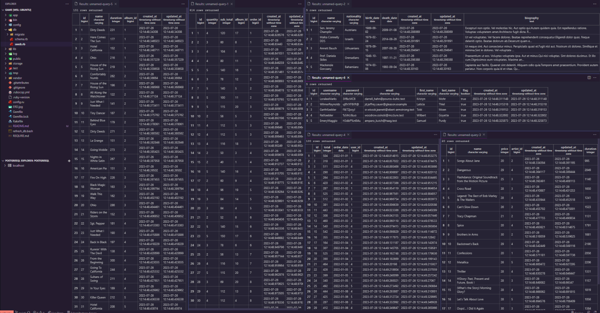

# README

## Description

This project demonstrates my ability to work with basic Ruby on Rails logic, manage models and databases, perform tests, and use tools like Faker to generate realistic data. During its development, I created a web application that allows you to efficiently view orders, users and albums. Implemented models, migrations, and validations to ensure valid data and integrity. In addition, I carried out exhaustive tests to ensure the correct functioning of the models and their compliance with requirements. While I haven't emphasized the use of callbacks and associations yet, I plan to improve future functionality and efficiency with these advanced techniques, providing an even richer experience for users.

## Results

## Considerations

The scenario presented assumes that the project receives existing data from the sale of a record label.
For this, it is assumed or initialized, with the following considerations:

1. Artists and users are created first, assuming that their data is correct.
1. As a result of these, the albums are created, with the established date, and then each song to which it belongs is included one by one. (It is assumed that the entry is uniform, since at the end, the duration table of said album is added # It is done in the following way to avoid resorting to the callback).
1. The record of the purchase or order, for this the object is created, and then the data of each item of the order begins to be loaded
1. Finally, the user data and date where the purchase is made are loaded. (It must be verified that this date is greater than the date of the artist's birth, the date of the creation of albums, and to make sure that it is not from the future, it must be less than the date of today).

For better understanding, the following logic is proposed:

```
create artist
create user
create album
  duration=0 # album duration
  while value=true
    create song, album_id
    duration+=song.duration
    value = false if end
  add duration
create order
  total=0
  while value_1=true
    create order_item, album_id, user_id
      sub_total=0
      while value_2=true
        add album.id
        add album.price as price
        add quantity
        sub_total+=price*quantity
        value_2 = false if end
      add sub_total
    value_1 = false if end
  add total
  add user
  add dates
```

## Model Creation

1.  ERD (Entity relationship diagram).

    

    The corresponding relationships between the models are shown below:

    | Model       | Relation   | Model       |
    | :---------- | :--------- | :---------- |
    | artists     | has_many   | albums      |
    | albums      | belongs_to | artists     |
    | albums      | has_many   | songs       |
    | songs       | belongs_to | albums      |
    | albums      | has_many   | order_items |
    | order_items | belongs_to | albums      |
    | orders      | has_many   | order_items |
    | order_items | belongs_to | orders      |
    | users       | has_many   | orders      |
    | orders      | belongs_to | users       |

    They are summarized for each model in:

    |    Model    |   belong_to    |      has_many      |
    | :---------: | :------------: | :----------------: |
    |   albums    |    artists     | songs, order_items |
    |   artist    |       -        |       albums       |
    |    songs    |     albums     |         -          |
    | order_items | albums, orders |         -          |
    |   orders    |     users      |    order_items     |
    |    users    |       -        |       orders       |

1.  Creating models from the terminal input:

    ```
    rails generate model Artist name nationality birth_date:date death_date:date
    rails generate model User username email password first_name last_name flag:boolean
    rails generate model Album name price:integer artist:references
    rails generate model Song name duration:integer album:references
    rails generate model Order total:integer order_date:date user:references
    rails generate model OrderItem quantity:integer sub_total:integer album:references order:references
    ```

1.  Creation of the requested migrations:

    ```
     rails generate migration AddBiographyToArtists
     rails generate migration AddDurationToAlbums
     rails generate migration AddIndexToUsers
     rails generate migration ChangeDataTypeForBiographyInArtists
    ```

    The following code must be included, for the corresponding migrations

    ```
      def change
       add_colunm :artists, :biography, :string
      end
      def change
       add_column  :albums, :duration, :integer
      end
      def change
       add_index :users, :username
       add_index :users, :email
      end
      def up
       change_column :artists, :biography, :text
      end
      def down
       change_column :artists, :biography, :string
      end
    ```

1.  Edition of the validation for the database.
    Following these, the validation for the model is performed.

    | Model     | Null False          |
    | --------- | ------------------- |
    | Album     | name, price         |
    | Song      | name, duration      |
    | Artist    | name                |
    | User      | name, password      |
    | OrderItem | sub_total, quantity |
    | Orders    | total, date         |

    _The **email** column was not placed with null:false, due to problems with the test._
    _*These configurations must be made at the end, so that the tests can be executed normally, since once the model validations have been carried out, these restrictions are applied to the database.*_

## Validations in the Models.

1. Artist Model Validation:

   - The date of birth (birth_date) cannot be in the future.
   - If the death date (death_date) is stored, two conditions must be met:

     - The date of birth (birth_date) must exist.
     - The death date (death_date) must be after the birth date (birth_date).

   The following validations are performed:

   ```
   class Artist < ApplicationRecord
     validates :name, uniqueness: true, presence: true
     validate :check_birth_date_presence
     validate :death_date_valid

     def check_birth_date_presence
       return unless death_date.present? && birth_date.blank?

       errors.add(:birth_date, "Must be present if death_date is provided")
     end

     def death_date_valid
       return unless birth_date.present? && death_date.present? && birth_date > death_date

       errors.add(:death_date, "must be greater than birth_date")
     end
   end
   ```

   The following test corresponds:

   ```
   require "test_helper"

   class ArtistTest < ActiveSupport::TestCase
     test "should not save artist without name" do
       artist = Artist.new
       assert_not artist.save, "Saved the artist without a name"
     end
     test "should save artist with valid name" do
       artist = Artist.new(name: "Joaquin")
       assert artist.save, "Could not save the artist with a valid name"
     end
     test "should not save artist with duplicate name" do
       artist_1 = Artist.create(name: "John Doe")
       artist_2 = Artist.new(name: "John Doe")
       assert_not artist_2.save, "Saved the artist with a duplicate name"
     end
     test "should require birth_date if death_date is provided" do
       artist = Artist.new(name: "Juan", death_date: "1998-01-01")
       assert_not artist.save, "Saved the artist with a death_date but no birth_date"
     end
     test "should save artist with valid birth_date and death_date" do
       artist = Artist.new(name: "Jane Doe", birth_date: Date.new(1990, 1, 1),
                           death_date: Date.new(2023, 1, 1))
       assert artist.save, "Could not save the artist with valid birth_date and death_date"
     end
     test "should not save artist with death_date earlier than birth_date" do
       artist = Artist.new(name: "Jane Doe", birth_date: Date.new(1990, 1, 1),
                           death_date: Date.new(1980, 1, 1))
       assert_not artist.save, "Saved the artist with death_date earlier than birth_date"
     end
     # Finish
   end
   ```

1. User Model Validation

   - Email must be in a valid email format.
   - The username is required and cannot be blank.
   - Password must be at least 6 characters long and must include at least one number.
   - By default, a client is active at the time of creation.
   - Both the username and the email must be unique in the database.

   The following validations are performed:

   ```
   class User < ApplicationRecord
     has_many :orders
     validates :username, presence: true,
                         format: { with: /\A[A-Za-z0-9]+\z/, message: "must only contain letters and numbers" },
                         uniqueness: true
     validates :email, presence: true,
                     format: { with: URI::MailTo::EMAIL_REGEXP, message: "must be a valid email address" },
                     uniqueness: true
     validates :password, length: { minimum: 6, message: "must be at least 6 characters long" },
                         format: { with: /\d/, message: "must include at least one number" }
     validates :first_name, presence: true
     validates :last_name, presence: true
     before_validation :default_flag_to_true

     def default_flag_to_true
       self.flag = true
     end
   end

   ```

   The following test corresponds:

   ```
   require "test_helper"

   class UserTest < ActiveSupport::TestCase
     def setup
       @user = User.new(
         username: "yull123",
         password: "password123",
         email: "yull@example.com",
         first_name: "yull",
         last_name: "Doe"
       )
       @user_1 = User.new(
         username: "yull123",
         password: "password123",
         email: "yull_30@example.com",
         first_name: "yull",
         last_name: "Doe"
       )
       @user_2 = User.new(
         username: "yull12345",
         password: "password123",
         email: "yull_30@example.com",
         first_name: "yull",
         last_name: "Doe"
       )
       @user_3 = User.new(
         username: "yull12345",
         password: "password123",
         email: "yull_30@exampl",
         first_name: "yull",
         last_name: "Doe"
       )
     end

     test "should be valid with all required attributes" do
       # skip
       assert @user.valid?, "User with all required attributes should be valid"
     end

     test "should not be valid without a username" do
       # skip
       @user.username = ""
       assert_not @user.valid?, "User without username should not be valid"
     end

     test "should only contain letters and numbers in the username" do
       # skip
       invalid_usernames = ["john_doe", "user@name", "user!name"]
       invalid_usernames.each do |username|
         @user.username = username
         assert_not @user.valid?, "Username should only contain letters and numbers"
       end
     end
     test "should have a unique username" do
       # skip
       @user.save
       assert_not @user_1.valid?, "User with duplicate username should not be valid"
     end
     test "should not save user with duplicate email" do
       # skip
       @user_1.save
       assert_not @user_2.valid?, "User with duplicate email should not be saved"
     end

     test "should not be valid without an email" do
       # skip
       @user_2.email = ""
       assert_not @user_2.valid?, "User without email should not be valid"
     end

     test "should have a valid email format" do
       # skip
       invalid_emails = ["johnexample", "johnexample.", "johnexample.com"]
       invalid_emails.each do |email|
         @user_2.email = email
         assert_not @user_2.valid?, "User should not be valid with invalid email: #{email}"
       end
     end

     test "should not be valid without a password" do
       # skip
       @user_2.password = ""
       assert_not @user_2.valid?, "User without password should not be valid"
     end

     test "should not be valid with a password less than 6 characters" do
       # skip
       @user_2.password = "pass1"
       assert_not @user_2.valid?, "User with password less than 6 characters should not be valid"
     end

     test "should not be valid with a password without a number" do
       # skip
       @user_2.password = "password"
       assert_not @user_2.valid?, "User with password without a number should not be valid"
     end

     test "should not be valid without a first_name" do
       # skip
       @user_2.first_name = ""
       assert_not @user_2.valid?, "User without first name should not be valid"
     end

     test "should not be valid without a last_name" do
       # skip
       @user_2.last_name = ""
       assert_not @user_2.valid?, "User without last name should not be valid"
     end

     test "should default flag to true before validation" do
       # skip
       @user_2.flag = nil
       @user_2.save
       assert_equal true, @user.flag
     end
   end
   ```

1. Album Model Validation

   - Each album has a name.
   - Each album has a price stored in cents.
   - An album has many songs.
   - An album belongs to an artist (only one artist).
   - A valid album always has a name.
   - A valid album always has a price greater than zero (in cents).
   - A valid album always has a duration greater than zero.

   The following validations are performed:

   ```
   class Album < ApplicationRecord
     belongs_to :artist
     has_many :songs
     has_many :order_items
     validates :name, presence: true
     validates :price, presence: true, numericality: { greater_than: 0 }
     validates :duration, presence: true, numericality: { greater_than: 0 }
   end
   ```

   The following test corresponds:

   ```
   require "test_helper"

   class AlbumTest < ActiveSupport::TestCase
     def setup
       Artist.create(name: "Artist 1")
     end

     test "should be valid with all required attributes" do
       # skip
       album = Album.new(
         name: "Example Album",
         price: 9.99,
         duration: 120,
         artist_id: Artist.find_by(name: "Artist 1").id
       )
       assert album.valid?
     end

     test "should not be valid without a name" do
       # skip
       album = Album.new(
         price: 9.99,
         duration: 120,
         artist_id: Artist.find_by(name: "Artist 1").id
       )
       assert_not album.valid?
     end

     test "should not be valid without a price" do
       # skip
       album = Album.new(
         name: "Example Album",
         duration: 120,
         artist_id: Artist.find_by(name: "Artist 1").id
       )
       assert_not album.valid?
     end

     test "should not be valid without a duration" do
       # skip
       album = Album.new(
         name: "Example Album",
         price: 9.99,
         artist_id: Artist.find_by(name: "Artist 1").id
       )
       assert_not album.valid?
     end
   end
   ```

1. Song Model Validation

   - Song must have a duration
   - Song must have a name
   - Song must be associated with only one album

   The following validations are performed:

   ```
   class Song < ApplicationRecord
     belongs_to :album
     validates :name, presence: true
     validates :duration, presence: true, numericality: { greater_than: 0 }
   end
   ```

   The following test corresponds:

   ```
   require "test_helper"

   class SongTest < ActiveSupport::TestCase
     def setup
       @artist = Artist.create(name: "Name")
       @album = Album.create(
         name: "Album",
         duration: 10,
         price: 10,
         artist_id: Artist.find_by(name: "Name").id
       )
     end
     test "Validations for Song" do
       song = Song.new(duration: 10, album_id: @album.id)
       assert_not song.valid?, "Shouldn't save Song with empty name"
       song_2 = Song.new(name: "", duration: 10, album_id: @album.id)
       assert_not song_2.valid?, "Shouldn't save Song with empty name"
       song_3 = Song.new(name: "Song", duration: 10, album_id: @album.id)
       assert song_3.valid?, "Shouldn't save Song with empty name"
     end

     test "Validations for duration" do
       song = Song.new(name: "Song", album_id: @album.id)
       assert_not song.valid?, "Shouldn't save without duration"
       song_2 = Song.new(name: "Song", duration: 0, album_id: @album.id)
       assert_not song_2.valid?, "Should not save with duration equal to zero"
       song_3 = Song.new(name: "Song", duration: -150, album_id: @album.id)
       assert_not song_3.valid?, "Shouldn't save with negative duration"
       song_4 = Song.new(name: "Song", duration: 50, album_id: @album.id)
       assert song_4.valid?, "Should save if duration is correct"
     end

     test "Validations for the belong_to relationship" do
       song = Song.create(name: "Song_1", duration: 50, album_id: @album.id)
       assert_equal song.album.id, @album.id,
                   "It should belong to the album with which it was declared"
     end
   end
   ```

1. Order Model Validation

   - Must contain a total greater than zero
   - Must contain an order_date
   - It must correctly contain the belong_to relationship

   The following validations are performed:

   ```
   class Order < ApplicationRecord
     belongs_to :user
     validates :order_date, presence: true
     validates :total, presence: true, numericality: { greater_than: 0 }
     validate :event_date_cannot_be_in_the_future

     private

     def event_date_cannot_be_in_the_future
       return unless order_date.present? && order_date > Date.today

       errors.add(:order_date, "Cannot be a future date")
     end
   end
   ```

   The following test corresponds:

   ```
   require "test_helper"

   class OrderTest < ActiveSupport::TestCase
     def setup
       @user = User.create(
         username: "yull23",
         password: "password123",
         email: "yull_30@example.com",
         first_name: "yull",
         last_name: "timoteo"
       )
     end

     test "Validations for order_date" do
       # skip
       order = Order.new(total: 20, user_id: @user.id)
       assert_not order.valid?, "It should not be saved with the order_date field empty"
       order = Order.new(order_date: "yull", total: 20, user_id: @user.id)
       assert_not order.valid?, "It should not be saved, if it is not given a correct date format"
       order = Order.new(order_date: "2995-01-01", total: 20, user_id: @user.id)
       assert_not order.valid?, "Shouldn't save to a future date"
       order = Order.new(order_date: "1995-01-01", total: 20, user_id: @user.id)
       assert order.valid?, "It should save correctly with a valid date"
     end

     test "Validations for total" do
       # skip
       order = Order.new(order_date: "1995-01-01", user_id: @user.id)
       assert_not order.valid?, "It should not be saved without the total field."
       order = Order.new(order_date: "1995-01-01", total: 0, user_id: @user.id)
       assert_not order.valid?, "Should not be saved with a total equal to zero"
       order = Order.new(order_date: "1995-01-01", total: -10, user_id: @user.id)
       assert_not order.valid?, "Should not be saved with a negative total"
       order = Order.new(order_date: "1995-01-01", total: 10, user_id: @user.id)
       assert order.valid?, "It should save the order correctly"
     end

     test "Validations for the belong_to relationship" do
       # skip
       order = Order.create(order_date: "2005-01-01", total: 10, user_id: @user.id)
       assert_equal order.user.id, @user.id,
                   "It should belong to the user with which it was created"
     end
   end
   ```

1. OrderItem Model Validation

   - Subtotal should be calculated automatically after saving
   - The quantity is required, greater than zero and integer
   - Each one must belong to an album and an order

   The following validations are performed:

   ```
   class OrderItem < ApplicationRecord
     belongs_to :album
     belongs_to :order

     before_save :calculate_sub_total

     validates :quantity, presence: true, numericality: { greater_than: 0, only_integer: true }

     private

     def calculate_sub_total
       self.sub_total = album.price * quantity
     end
   end
   ```

   The following test corresponds:

   ```
   require "test_helper"

   class OrderItemTest < ActiveSupport::TestCase
     def setup
       @user = User.create(
         username: "yull23",
         password: "password123",
         email: "yull_30@example.com",
         first_name: "yull",
         last_name: "timoteo"
       )
       @artist = Artist.create(name: "Artist")
       @order = Order.create(order_date: "2005-01-01", total: 50, user_id: @user.id)
       @album = Album.create(
         name: "Example Album",
         price: 10,
         duration: 120,
         artist_id: @artist.id
       )
       @order_item_test = OrderItem.create(quantity: 50, order_id: @order.id, album_id: @album.id)

       # print @order.save, @album.save, @order_item_test.save
       # puts @order_item_test.save
     end

     test "Validations for quantity" do
       # skip
       order_item = OrderItem.new(order_id: @order.id, album_id: @album.id)
       assert_not order_item.valid?, "It should not be saved, without the number of albums"
       order_item = OrderItem.new(order_id: @order.id, album_id: @album.id, quantity: 0)
       assert_not order_item.valid?, "Should not be saved with a number of albums equal to zero"
       order_item = OrderItem.new(order_id: @order.id, album_id: @album.id, quantity: -10)
       assert_not order_item.valid?, "It should not store a negative value for quantity"
       order_item = OrderItem.new(order_id: @order.id, album_id: @album.id, quantity: 5.56)
       assert_not order_item.valid?, "Should not accept values ​​other than an integer"
       order_item = OrderItem.new(order_id: @order.id, album_id: @album.id, quantity: 50)
       assert order_item.valid?, "It should save correctly with the positive and integer amount"
     end

     test "Validation for relationship belong_to" do
       assert_equal @order_item_test.album.id, @album.id,
                   "The album it belongs to must be the one that was declared"
       assert_equal @order_item_test.order.id, @order.id,
                   "The order it belongs to must be the one that was declared"
     end

     test "Verification of the calculation of the subtotal" do
       assert_equal @order_item_test.sub_total, @album.price * @order_item_test.quantity, ""
     end
   end
   ```

## Utilización de Faker y rails db:seed, para creación de datos.

It was done by the following procedure

- Artist Creation: I used the Faker gem to generate fictitious artist data, such as names, nationality, biography, and dates of birth and death.

  ```
  puts "Create Artists"
  5.times do
    Artist.create(
      name:Faker::Name.name,
      nationality:Faker::Nation.nationality,
      biography:Faker::Lorem.paragraphs(number: 5).join(""),
      birth_date:Faker::Date.between(from: '1940-01-01', to: '1990-12-31'),
      death_date:Faker::Date.between(from: '1990-01-01', to: '2023-12-31')
    )
  end
  artist_ids=Artist.ids
  # p artist_ids
  ```

- User Creation: Also with the help of Faker, I generated users with strong passwords, first names, last names, unique usernames and valid email addresses.

  ```
  puts "Create Users"
  5.times do
    User.create(
      password: Faker::Internet.password(min_length: 8, max_length: 12, mix_case: true, special_characters: true),
      first_name: Faker::Name.first_name,
      last_name: Faker::Name.last_name,
      username:Faker::Name.first_name+Faker::Name.last_name,
      email: Faker::Internet.email(name:Faker::Name.name)
    )
  end
  user_ids=User.ids
  # p user_ids
  ```

- Creation of Albums with Songs: I developed the logic to create albums with their respective songs using random data from the Faker gem. Each album has a name, a price, and an associated artist. The songs also have random names and durations, and are linked to the corresponding album.

  ```
  puts "Creation of albums with their respective songs "
  20.times do
    album=Album.create(
      name: Faker::Music.album,
      price: rand(20..30),
      # duration:0,
      artist_id: artist_ids.sample
    )
    i=rand(5..10)
    i.times do
      song=Song.create(
        name:Faker::Music::RockBand.song,
        duration:rand(120..300),
        album_id:album.id
      )
      album.duration+=song.duration
    end
    album.save
  end
  album_ids=Album.ids
  # p album_ids
  ```

- Creation of Orders with Order Details: I implemented the generation of orders with order details. Each order has an order date that is generated sequentially from a start date. A user is also randomly assigned to each order. Order details are randomly generated, with a quantity and album linked.

  ```
  # Help function
  def generic_order_date(count,initial_date,number_orders)
    increase=count/number_orders
    date_object = Date.parse(initial_date)
    next_date_object = date_object + increase
    next_date_object.to_s
  end

  puts "Creation of Orders with their respective order details"

  initial_date="2022-01-01" # First order date
  100.times do |n|
    order=Order.create(
      order_date:generic_order_date(n,initial_date,5), # Create x orders per day
      user_id:user_ids.sample
    )
    i=rand(3..5)
    i.times do
      order_item=OrderItem.create(
        quantity:rand(2..5),
        album_id:album_ids.sample,
        order_id:order.id
      )
      order.total+=order_item.sub_total
    end
    order.save
  end
  ```

These steps allow you to create a complete model that represents artists, users, albums, and songs, and how they are related to each other through orders and order details.


